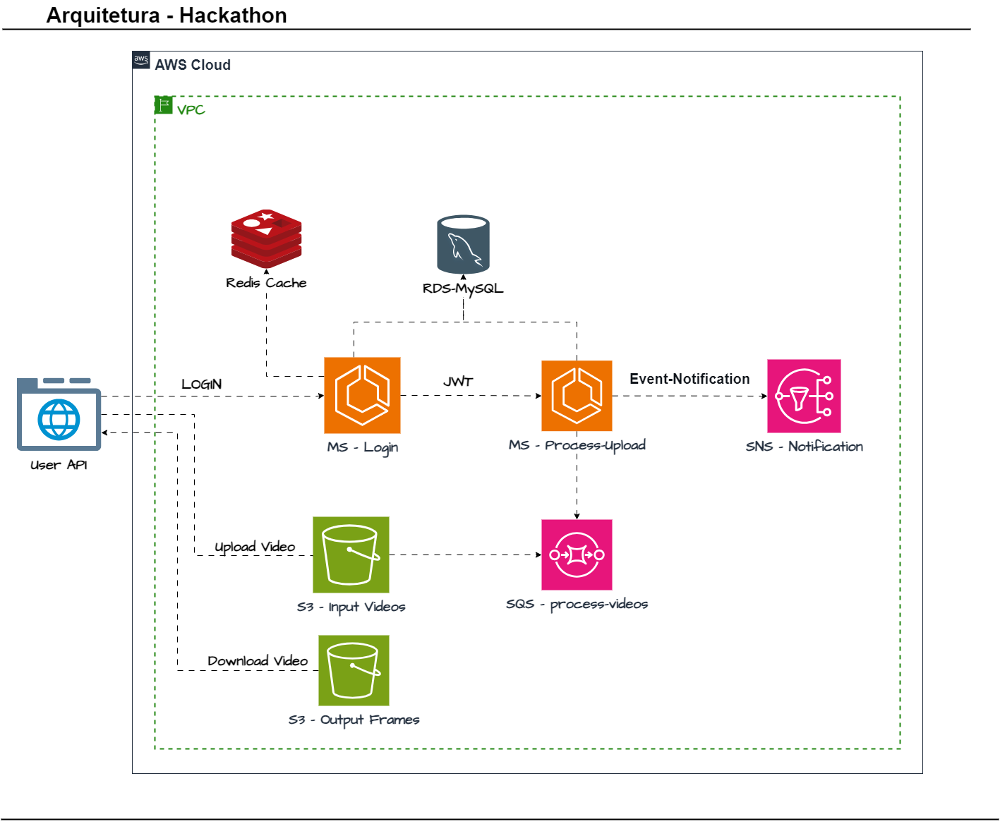
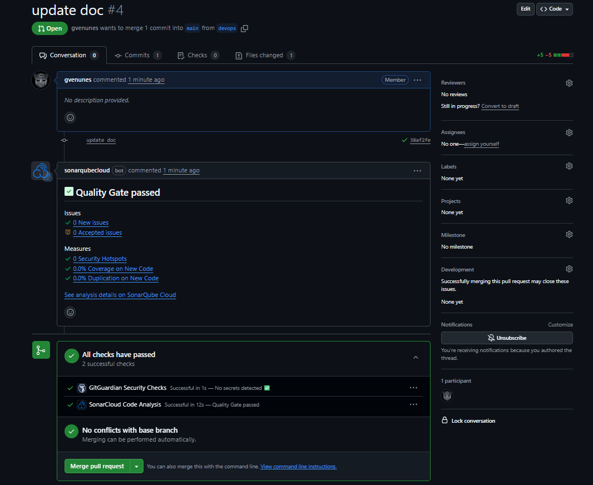
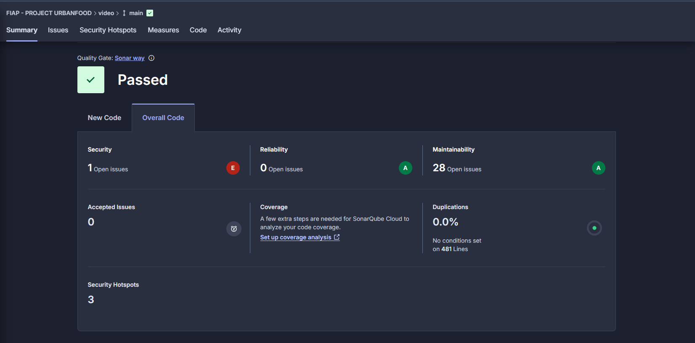
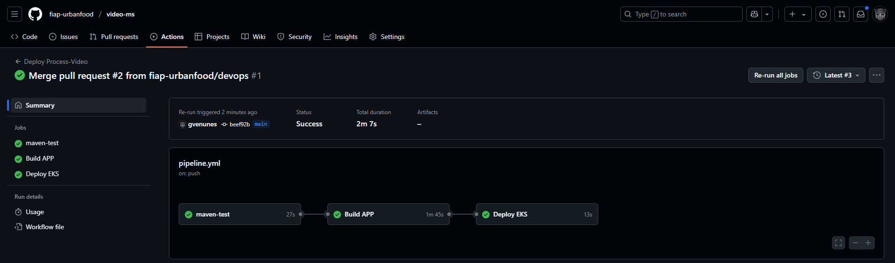
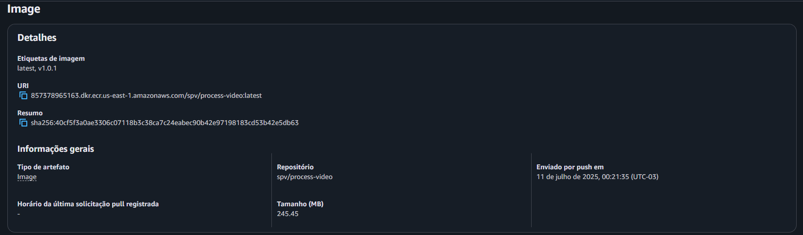
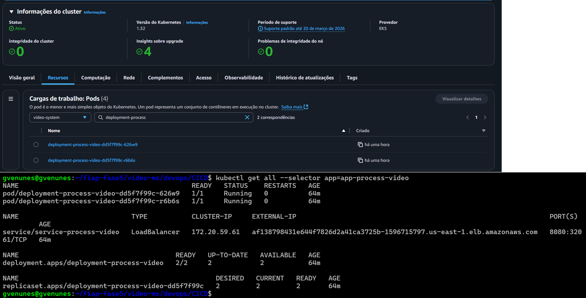

# 💻 Projeto video-ms

Sistema de Processamento de Vídeo, capta o video e extrai os frames dele e disponibiliza o download para o usuario.

# ###########################################################
# 💻 Arquitetura do Serviço



# ###########################################################
# 💻 VIDEO DE APRESENTAÇÃO DO PROJETO

https://www.youtube.com/watch?v=jbnfhMVp4zo&t=6s

# ###########################################################
# 💻 Deploy via Github Actions

### Executando o CI/CD

Etapas do Pipeline via github actions:

1.1 Pull Request com sonar code quality e GitGuardian Security:


1.2 Sonar para análise e monitoramento contínuo da qualidade do código.


1.3 Build da Aplicação:


1.4 Push da Imagem para o ECR.


1.5 Deploy no EKS.


# ###########################################################
# 💻 Deploy via DockerFile

### 1. Preparar o ambiente para gerar o pacote

1.1 Compilar o jar
``` bash
mvn clean install
```

1.2 Rodar o test da app
``` bash
mvn test
```

1.3 Exemplo de como criar as Variáveis de Ambiente..
``` bash
export API_IMAGE_TAG='1.0.0'
export AWS_REGION='us-east-1'
export AWS_ACCOUNT='857378965163'
```

1.4 Docker Build na raiz do projeto..
``` bash
docker build --no-cache --progress=plain -f devops/Dockerfile -t process-video:$API_IMAGE_TAG .
docker tag process-video:$API_IMAGE_TAG $AWS_ACCOUNT.dkr.ecr.$AWS_REGION.amazonaws.com/spv/process-video:$API_IMAGE_TAG
docker tag $AWS_ACCOUNT.dkr.ecr.$AWS_REGION.amazonaws.com/spv/process-video:$API_IMAGE_TAG $AWS_ACCOUNT.dkr.ecr.$AWS_REGION.amazonaws.com/spv/process-video:latest
```

1.5 Docker Login ECR..
``` bash
aws ecr get-login-password --region $AWS_REGION  --profile terraform-iac | docker login --username AWS --password-stdin $AWS_ACCOUNT.dkr.ecr.$AWS_REGION.amazonaws.com

```

1.6 Docker Push do APP..
``` bash
docker push $AWS_ACCOUNT.dkr.ecr.$AWS_REGION.amazonaws.com/spv/process-video:$API_IMAGE_TAG
docker push $AWS_ACCOUNT.dkr.ecr.$AWS_REGION.amazonaws.com/spv/process-video:latest
```

1.7 Rodando o container local..
``` bash
docker run -dit -p 8080:8080 --name=process-video process-video:$API_IMAGE_TAG -e AWS_REGION='us-east-1'
```

1.8 Acesso a API..
``` bash
http://localhost:8080/api/video
```

# ###########################################################
# 💻 Deploy no EKS

## Processo Automatizado via Github Actions

## Configuração do kubectl

2.1 Configurar o acesso ao cluster
``` bash
aws eks update-kubeconfig --region us-east-1 --name k8s-urbanfood --profile terraform-iac
```

2.2 Entramos no diretório do k8s para subir o ambiente.
``` bash
cd k8s/
kubectl apply -f aws-auth.yml
kubectl apply -f namespace.yml
```

2.3 Acessando o namespace, "Após já ter sido criado"
``` bash
kubectl config set-context --current --namespace=video-system
```

Após criar e configurar a infra executamos o github actions do projeto. 

Para documentar: 

2.4 Para subir a aplicação de forma manual:
``` bash
kubectl apply -f app/video-service.yaml
kubectl apply -f app/video-hpa.yaml
kubectl apply -f app/video-deployment.yaml
```
